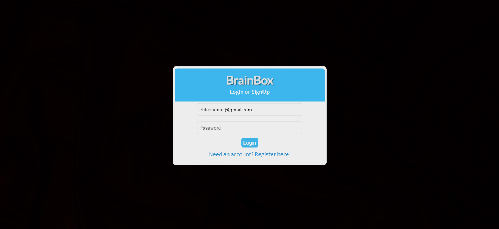

Install Instructions:

1. Clone the repository to your device.
2. Move the project folder to XAMPP/htdocs
3. Turn on both Apache and MySQL server.
4. Create a new database callled 'classroom_database'(Check the .sql file for the correct database name) and import the .sql file from the model folder.
5. Go to localhost/[project folder name]
6. You should be able to see the website login page.

**Sprint 1**

Register Page

