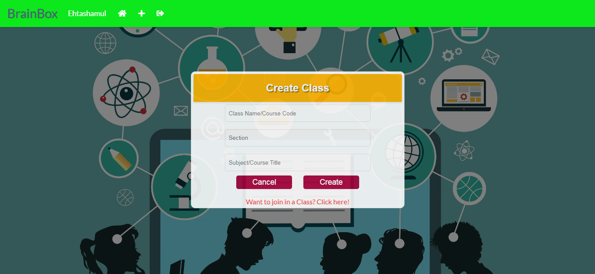
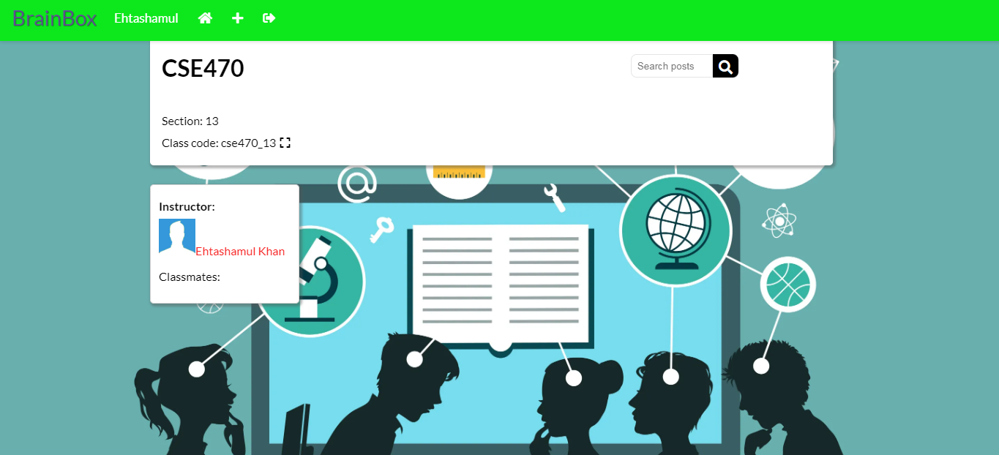
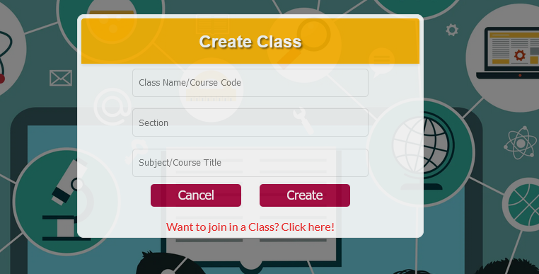

Install Instructions:

1. Clone the repository to your device.
2. Move the project folder to XAMPP/htdocs
3. Turn on both Apache and MySQL server.
4. Create a new database callled 'classroom_database'(Check the .sql file for the correct database name) and import the .sql file from the model folder.
5. Go to localhost/[project folder name]
6. You should be able to see the website login page.

**Sprint 1**

Log In

Register

Create Class

Join Class

Classroom Created

Inside the Classroom

**Sprint Leader:** Md.Ehtashamul Islam Khan
**Requirements:**

1. Sabrina Rahman Mazumder: Completed - Teacher can send invitation codes to students.
2. Zawadul Kafi Nahee: Completed - Teachers can create class rooms.
3. Md. Ehtashamul Islam Khan: Completed - Teacher who created the room can delete the room.
4. Arittra Paul Ankur: Completed - Teacher can send invitation codes to students.

**Sprint 2**

Add Courses

Create Courses

Remove Section

Upload Lesson

**Sprint Leader:** Sabrina Rahman Mazumder
**Requirements:**

1. Sabrina Rahman Mazumder: Completed - Students can add their desired courses.
2. Zawadul Kafi Nahee: Completed - Students and teachers can search courses.
3. Md. Ehtashamul Islam Khan: Completed - Teachers can upload lessons.
4. Arittra Paul Ankur: Completed - Teachers and students can view the timeline.

